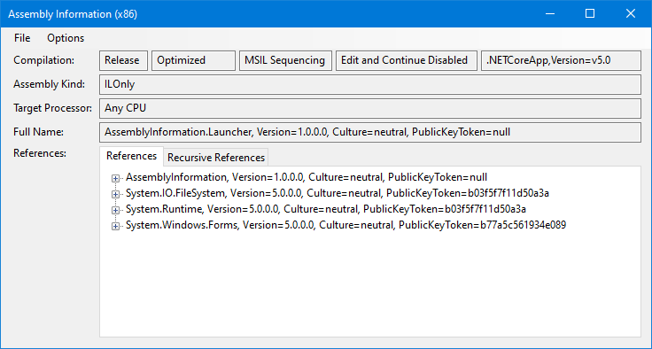
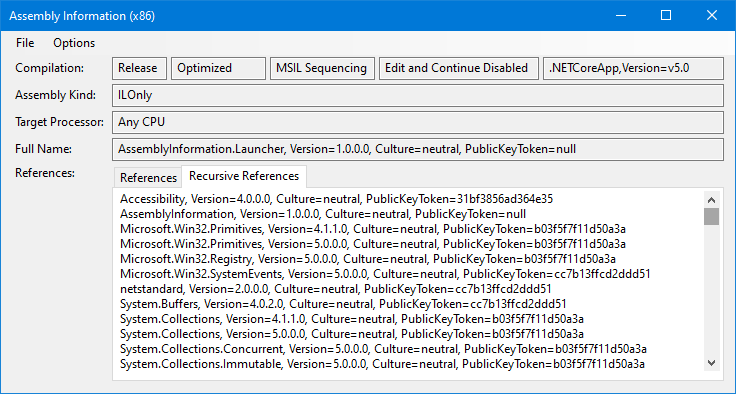

# AssemblyInformation

This tool displays interesting information for any .NET / Framework / Standard / Core assembly. It supports 32- and 64-Bit assemblies as well as 32- and 64-Bit windows systems.

The original idea and tool is based on this [CodePlex](https://archive.codeplex.com/?p=assemblyinformation) project. Thanks for that.\
My own version of this tool has (better) support for the new .NET types (Standard, Core, etc.) and still works when some dependencies are missing.

It currently supports the following information:
- Compilation mode (Debug/Release)
- Target framework
- Target processor
- Assembly full name
- Direct and recursive references
- ...and some more

The assembly (and it's references) you are viewing don't get blocked by this tool. You still can edit/move/delete that assemblies.

## Prerequisites
- [.NET Desktop Runtime 5.0](https://dotnet.microsoft.com/download/dotnet/5.0) - You might need both (x86 and x64) for full support

## How to use
- Download and unpack a release
- Then add an entry to your context menu (for _.exe_ and _.dll_ extension) by running _[Add Shell Extension.ps1](AssemblyInformation.Launcher/Add%20Shell%20Extension.ps1)_
- Right an assembly and click _AssemblyInformation_

Alternatively you can drag and drop an assembly onto _AssemblyInformation.Launcher.exe_ directly.

To remove the shell extension again run _[Remove Shell Extension.ps1](AssemblyInformation.Launcher/Remove%20Shell%20Extension.ps1)_.

## Screenshots

